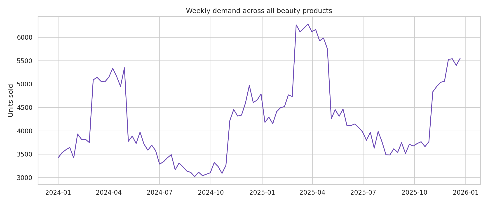

# Beauty FMCG Demand Forecasting & Inventory Optimization

An end-to-end analytics portfolio project that converts weekly beauty-product sales into demand forecasts and practical replenishment decisions. Built to demonstrate business analytics, predictive modeling, and decision communication for FMCG data roles.

## Project Presentation

- [View the final presentation as PDF](05_Presentation/Beauty_FMCG_Inventory_Optimization.pdf)

## Business problem

Beauty FMCG teams must balance product availability with working-capital efficiency. Underforecasting creates stockouts and missed sales; overforecasting locks cash in slow-moving inventory. This project answers:

1. How does demand vary by product, channel, region, promotion, and season?
2. Can a time-aware machine-learning model outperform a last-week baseline?
3. Which SKU–channel–region combinations require replenishment or show overstock risk?

## Dataset

The project uses a reproducible **synthetic dataset** containing weekly sales for 6 fictional SKUs, 3 channels, and 3 Indonesian market regions during 2024–2025. It contains no proprietary or personal data. The generator explicitly models trend, seasonality, Ramadan/year-end uplift, promotion, marketing, and random demand variation.

## Analytical workflow


The model uses lagged demand, rolling statistics, calendar signals, promotion, marketing, product, channel, and region. Data before October 2025 is used for training; later observations form an untouched holdout set. Performance is reported with MAE, RMSE, and WAPE and compared with a naïve last-week forecast.

## Key results

| Holdout metric | Forecast model | Last-week baseline | Improvement |
|---|---:|---:|---:|
| MAE | 12.86 units | 18.45 units | 30.3% |
| RMSE | 17.71 units | 25.51 units | 30.6% |
| WAPE | 14.68% | 21.05% | 30.3% |

In the illustrative inventory scenario, 27 of 54 SKU–channel–region combinations are flagged for replenishment, with 1,272 recommended units in total; 7 combinations show overstock risk. Skincare is the largest category, contributing approximately IDR 24.6 billion in simulated net revenue. These figures describe synthetic data and should be interpreted as a decision-workflow demonstration.




## Decision framework

Safety stock and reorder point are calculated as:

`Safety stock = z × demand standard deviation × √lead time`

`Reorder point = forecast demand × lead time + safety stock`

The demonstrator assumes a two-week lead time and a 95% cycle service level. These are scenario assumptions, not universal policy recommendations.

## Repository structure

```
├── 05_Presentation/
│   └── Beauty_FMCG_Inventory_Optimization.pdf
├── data/
│   ├── processed/beauty_fmcg_weekly_sales.csv
│   └── README.md
├── outputs/
│   ├── figures/
│   ├── category_performance.csv
│   ├── inventory_recommendations.csv
│   ├── model_metrics.json
│   └── test_forecasts.csv
├── src/
│   ├── generate_data.py
│   └── run_analysis.py
├── LICENSE
├── README.md
└── requirements.txt
```

## Reproduce

```bash
python -m venv .venv
source .venv/bin/activate  # Windows: .venv\Scripts\activate
pip install -r requirements.txt
python src/generate_data.py
python src/run_analysis.py
```

## Business use

The output table ranks combinations that need replenishment, estimates order quantities, and flags potential overstock. In a production setting, the next step would be to replace synthetic inputs with ERP data, tune lead times and service levels by SKU class, incorporate supplier constraints, and monitor forecast drift.

## Limitations

- Synthetic demand is useful for demonstrating the workflow but cannot establish real commercial impact.
- The holdout evaluation is historical and does not simulate all supply-chain constraints.
- Inventory recommendations simplify minimum order quantity, shelf life, case packs, and supplier capacity.

## Author

**Mohammad Maliki Rafli** — Public Health master's student focusing on Biostatistics and Health Data Science.

Open to discussion about the analysis, data assumptions, or potential collaboration.
