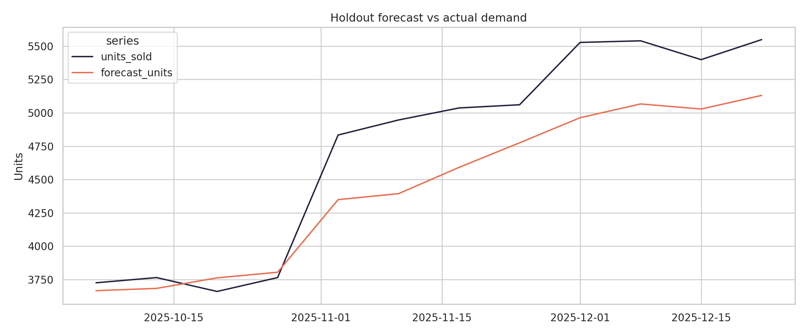

# Beauty FMCG Demand Forecasting and Inventory Optimization


[](LICENSE)

An end-to-end analytics portfolio project that transforms weekly beauty-product sales into demand forecasts and actionable inventory decisions. The project demonstrates business problem framing, time-aware predictive modeling, model evaluation, and decision communication for FMCG data and analytics roles.

**Author:** Mohammad Maliki Rafli  
**Program:** Master of Public Health, Universitas Airlangga

## Table of Contents

- [Project Overview](#project-overview)
- [Project Materials](#project-materials)
- [Business Objective](#business-objective)
- [Repository Structure](#repository-structure)
- [Analytical Workflow](#analytical-workflow)
- [Model and Evaluation](#model-and-evaluation)
- [Key Results](#key-results)
- [Selected Visualizations](#selected-visualizations)
- [Inventory Decision Framework](#inventory-decision-framework)
- [Data Transparency](#data-transparency)
- [Reproducing the Analysis](#reproducing-the-analysis)
- [Limitations](#limitations)
- [Recommendations](#recommendations)
- [License and Portfolio Use](#license-and-portfolio-use)
- [Contact](#contact)

## Project Overview

Beauty FMCG businesses must maintain product availability while controlling working capital. Underforecasting can create stockouts and lost sales, whereas overforecasting can increase inventory holding costs and slow-moving stock.

This project uses a reproducible synthetic dataset to demonstrate how sales history, promotions, marketing expenditure, seasonality, product characteristics, sales channels, and market regions can support demand forecasting and replenishment decisions.

## Project Materials

- [View the final presentation](05_Presentation/Beauty_FMCG_Demand_Forecasting_and_Inventory_Optimization.pdf)
- [Read the analytical report](01_Report/Beauty_FMCG_Demand_Forecasting_Analytical_Report.md)
- [Review model metrics](04_Output/model_metrics.json)
- [Review inventory recommendations](04_Output/inventory_recommendations.csv)

## Business Objective

1. Examine demand variation across products, categories, channels, regions, promotions, and seasonal periods.
2. Assess whether a time-aware machine-learning model outperforms a naïve last-week baseline.
3. Identify SKU–channel–region combinations requiring replenishment or indicating potential overstock.

## Repository Structure

```text
.
├── 01_Report/
│   └── Beauty_FMCG_Demand_Forecasting_Analytical_Report.md
├── 02_Script/
│   ├── generate_data.py
│   └── run_analysis.py
├── 03_Data/
│   ├── README.md
│   └── processed/
│       └── beauty_fmcg_weekly_sales.csv
├── 04_Output/
│   ├── figures/
│   │   ├── forecast_vs_actual.png
│   │   └── weekly_demand.png
│   ├── category_performance.csv
│   ├── inventory_recommendations.csv
│   ├── model_metrics.json
│   └── test_forecasts.csv
├── 05_Presentation/
│   └── Beauty_FMCG_Demand_Forecasting_and_Inventory_Optimization.pdf
├── .gitignore
├── LICENSE
├── README.md
└── requirements.txt
```

## Analytical Workflow


Observations before October 2025 are used for training, while later observations form an untouched temporal holdout set. Predictors include demand lags, rolling statistics, calendar indicators, promotion status, discounts, marketing expenditure, category, channel, and region.

## Model and Evaluation

**Model:** `HistGradientBoostingRegressor` with one-hot encoding for categorical predictors.  
**Benchmark:** naïve last-week demand forecast.  
**Metrics:** MAE, RMSE, and WAPE.

## Key Results

| Holdout metric | Forecast model | Last-week baseline | Improvement |
|---|---:|---:|---:|
| MAE | 12.86 units | 18.45 units | 30.3% |
| RMSE | 17.71 units | 25.51 units | 30.6% |
| WAPE | 14.68% | 21.05% | 30.3% |

In the illustrative inventory scenario:

- **27 of 54** SKU–channel–region combinations were flagged for replenishment.
- The total recommended replenishment quantity was **1,272 units**.
- **7 combinations** were flagged as potential overstock.
- Skincare contributed approximately **IDR 24.6 billion** in simulated net revenue.

These results use synthetic data and demonstrate the decision workflow rather than real commercial impact.

## Selected Visualizations

### Holdout forecast versus actual demand


### Weekly demand trend



## Inventory Decision Framework

`Safety stock = z × demand standard deviation × √lead time`

`Reorder point = forecast demand × lead time + safety stock`

The demonstrator assumes a two-week lead time and a 95% cycle service level (`z = 1.645`). These assumptions should be calibrated to product criticality, supplier performance, shelf life, and service-level targets before operational use.

## Data Transparency

The dataset is fully synthetic and contains no confidential company, customer, or personal information. It represents six fictional beauty products across three sales channels and three Indonesian market regions during 2024–2025.

## Reproducing the Analysis

```bash
git clone https://github.com/mohmalikirafli/beauty-fmcg-demand-forecasting.git
cd beauty-fmcg-demand-forecasting
python -m venv .venv
# Windows: .venv\Scripts\activate
# macOS/Linux: source .venv/bin/activate
pip install -r requirements.txt
python 02_Script/generate_data.py
python 02_Script/run_analysis.py
```

The generated dataset is saved in `03_Data/processed/`, while analytical outputs and figures are saved in `04_Output/`.

## Limitations

- Synthetic demand cannot establish real-world commercial performance.
- Evaluation uses one temporal holdout rather than rolling-origin cross-validation.
- Inventory logic excludes minimum order quantity, case packs, shelf life, supplier capacity, and stockout costs.
- Lead time and service level are fixed across all SKU combinations.
- Competitor activity, price elasticity, distribution coverage, and macroeconomic variables are not modeled.

## Recommendations

- Replace synthetic inputs with validated ERP, sell-in, sell-out, promotion, and inventory data.
- Apply rolling-origin backtesting.
- Segment service levels and lead times by SKU importance and demand volatility.
- Incorporate order constraints, shelf life, and supplier capacity.
- Monitor forecast bias, WAPE, stockouts, overstock, and model drift.
- Compare machine learning with statistical and hierarchical forecasting methods.

## License and Portfolio Use

The source code is available under the [MIT License](LICENSE). The report, presentation, figures, and portfolio materials remain the intellectual work of the author and should receive appropriate attribution when referenced or adapted.

## Contact

For questions, professional discussion, or collaboration, contact **Mohammad Maliki Rafli** through the [GitHub profile](https://github.com/mohmalikirafli) or open an [issue](https://github.com/mohmalikirafli/beauty-fmcg-demand-forecasting/issues).

---

This repository is intended for portfolio purposes in FMCG analytics, demand forecasting, and inventory optimization.
